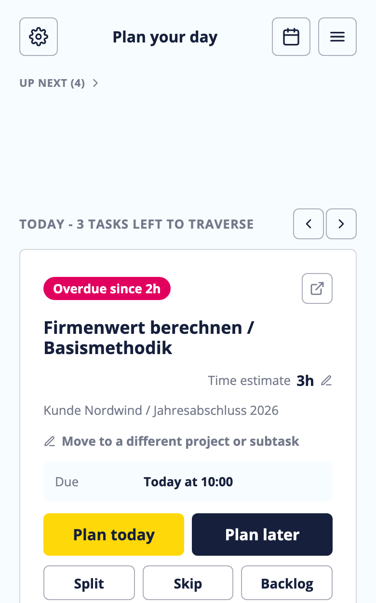
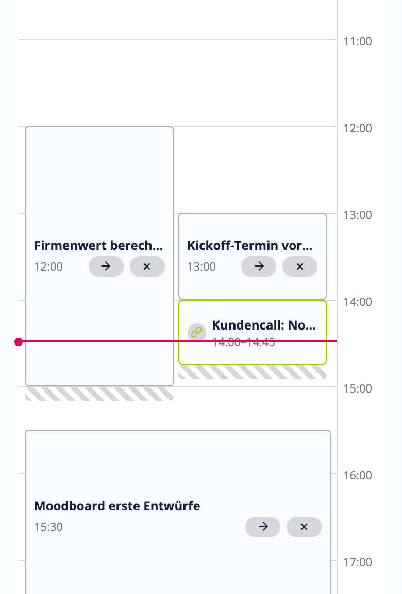
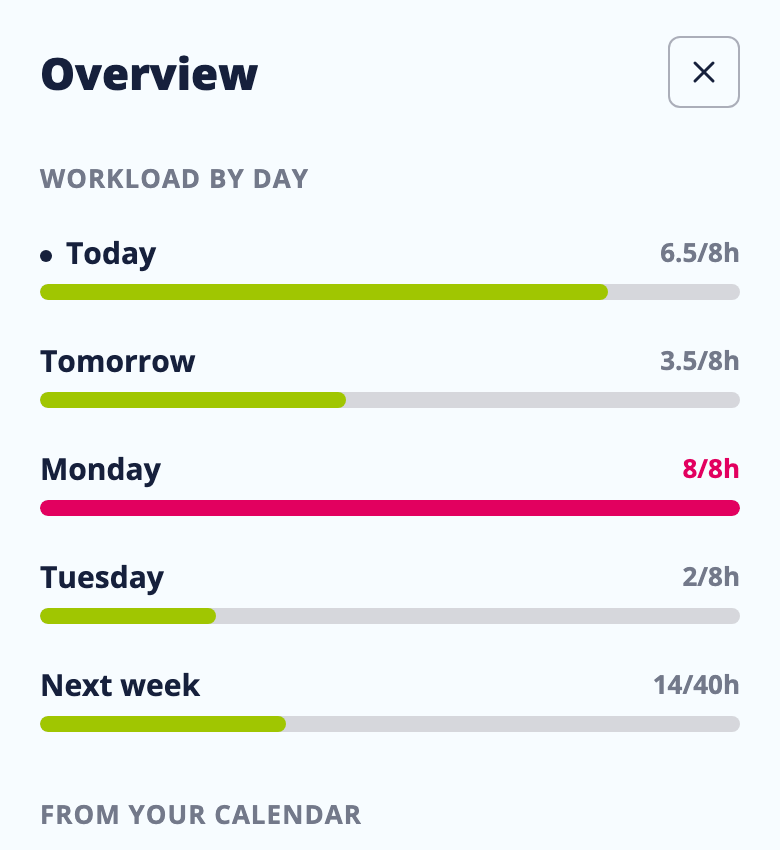

# Day Planner

A mobile-web app that helps people at a creative agency pre-plan their upcoming days: triage overdue/unplanned Asana tasks one at a time, decide when to realistically do them, see how full each day already is, and reconcile unlinked Outlook calendar events with Asana tasks. It sits alongside Asana and Outlook — it doesn't replace either, and all planning writes back to Asana as the source of truth.

The original Claude Design handoff — product briefing, screen-by-screen spec, and the interactive prototype it was built from — lives in [`design_handoff_day_planner/`](./design_handoff_day_planner). This app implements that spec, plus real sign-in (Login / Connect-secondary-provider screens and a "Primary" account tag in Integrations) that the linked prototype snapshot predates but the briefing's OAuth requirements call for.

<p>
  
  
  
</p>

## Layout

- **`app/`** — the frontend: Svelte 5 + TypeScript + Vite, no backend framework knowledge required to read.
- **`server/`** — the backend: Express + TypeScript + Prisma/Postgres. Handles Asana and Microsoft (Outlook/Graph) OAuth, encrypted token storage, and proxies the Asana/Graph APIs so the browser never sees a raw access token.
- **`design_handoff_day_planner/`** — the original design bundle (spec + prototype) this was built from.
- **`Dockerfile`** / **`docker-compose.yml`** — builds both into one image (the server serves the built frontend's static files) plus a Postgres container.
- **`deploy/docker-compose.prod.yml`** — the pull-only production compose file (see "Production" below).
- **`scripts/`** — `rebuild.sh` (local rebuild+restart with build metadata baked in) and `publish.sh` (build + push the production image to GHCR).

## Configuration

There's a single `.env` at the project root — copy it from `.env.example`:

```
cp .env.example .env
# fill in POSTGRES_PASSWORD, TOKEN_ENCRYPTION_KEY, SESSION_JWT_SECRET (openssl rand -base64 32 for the latter two)
```

Docker Compose auto-loads it from this exact path. Running the server directly on the host (`npm run dev`/`npm test`/`npm run prisma:*` in `server/`) also loads it, via `--env-file-if-exists=../.env` in `server/package.json` — so there's nowhere else to duplicate secrets, and the two ways of running the app always agree on config. See the comments in `.env.example` for what each variable does (including `DATABASE_URL`, which only matters for the host-process path — Docker Compose builds its own from the `POSTGRES_*` vars).

`PORT` (default 3000) drives both the published host port and the port the server binds inside the container, so changing it in `.env` is enough — there's no second place to keep in sync. `POSTGRES_PORT` (default 55433) only affects the localhost-only port Postgres is published on for host tooling.

## Running with Docker Compose

```
docker compose up --build
```

Open http://localhost:3000 (or whatever `PORT` you set).

For local iteration there's also `./scripts/rebuild.sh`, which does the same rebuild-and-restart but bakes the current commit, dirty flag, and a fresh build id into the image so the running app can identify itself and offer a reload when it's out of date. Pass `DEV_NOTE="what you're testing"` to have it listed on the loading screen while the change is uncommitted.

## Production

**Direct (e.g. testing on a server without a registry):** clone the repo onto the server, set up `.env` as above (with `PUBLIC_APP_URL` set to the real `https://` URL — see "HTTPS" below), and run `docker compose up -d --build` from the repo root. The container runs `prisma migrate deploy` automatically on startup, so there's no separate migration step.

**Via GitHub Container Registry (the recommended approach, same as `asana-sales-autostatus`):** the image is published to `ghcr.io/andrelung/day-planner`, and a production stack only ever pulls it — no source tree, no git, no build step on that host at all. That stack's compose file is [deploy/docker-compose.prod.yml](deploy/docker-compose.prod.yml); paste it into Dockge (or any other stack manager) when creating the stack there, or run it directly with `docker compose -f deploy/docker-compose.prod.yml up -d`. Place a `.env` file (same as above) alongside it in the stack's directory.

To publish an update after any code change:
```bash
docker login ghcr.io   # one-time, needs a GitHub PAT with write:packages scope
./scripts/publish.sh
```
`publish.sh` builds for `linux/amd64` specifically — a plain `docker build`/`docker compose build` targets whatever architecture it's running on, which silently produces an arm64-only image on an Apple Silicon dev machine and then fails to pull on a typical amd64 Linux server (`no matching manifest for linux/amd64`). Add `,linux/arm64` to the `--platform` list in that script if the image should also run natively on Apple Silicon hosts.

Then recreate the stack (Dockge's update button, or `docker compose -f deploy/docker-compose.prod.yml pull && docker compose -f deploy/docker-compose.prod.yml up -d`) to pull and restart with the new image. That's the entire update mechanism — no SSH into the app, no git on the production side.

**Package visibility:** a freshly-pushed GHCR package is private to your GitHub account by default — **keep it that way** and grant access to whichever account or org the production host authenticates as (which then needs its own `docker login ghcr.io`, with a PAT scoped to `read:packages` only). Unlike `asana-sales-autostatus`, there's no reason to make this one public: the image contains the full built application, and a private package costs nothing here since only your own server pulls it.

The image itself carries no secrets — `.env` is excluded from the build context via `.dockerignore`, every credential arrives at runtime from the compose file's `environment:` block, and `publish.sh` deliberately doesn't pass `DEV_NOTES_JSON` (so in-development notes never ship in a published build). The only things baked in are the commit hash, dirty flag, and build id.

**HTTPS:** the container only speaks plain HTTP (on `PORT`, default 3000) either way. Asana's OAuth and most Microsoft Entra configurations reject non-HTTPS redirect URIs, so production needs a reverse proxy (Caddy, Traefik, nginx+certbot, whatever's already handling TLS on that host) terminating TLS in front of the app's published port, with `PUBLIC_APP_URL` set to that `https://` URL. Register `https://<your-domain>/auth/asana/callback` and `https://<your-domain>/auth/outlook/callback` as redirect URIs in the Asana app and Azure app registration respectively (see "Registering the OAuth apps" below).

### Handling the production secrets

Generate **fresh** values for `TOKEN_ENCRYPTION_KEY`, `SESSION_JWT_SECRET`, and `POSTGRES_PASSWORD` on the production host (`openssl rand -base64 32`) — never copy them over from a dev machine's `.env`. `TOKEN_ENCRYPTION_KEY` in particular encrypts every stored Asana/Microsoft refresh token at rest, so rotating it later invalidates all of them and forces everyone to sign in again.

Two commands print every secret in full, so avoid them when screen-sharing or pasting into a ticket: `docker compose config` (resolves and echoes the whole file) and `docker compose exec app env`. To check a single value, `grep` the specific key out of `.env` instead.

The production stack mounts only a dedicated `./logs` subdirectory into the container, not the stack directory itself — the app writes nothing but its audit/diagnostic files (see "Change log" below), and there's no reason for the container to be able to read the `.env` sitting next to it. Create it with `mkdir -p logs` next to the compose file before first start.

### Which build is actually running

Every image records the commit it was built from, a dirty flag, and a unique build id. They're visible three ways: `GET /api/version`, the app's own Settings screen, and the loading screen's footer. Before concluding a fix "didn't work," check that first — it's the fastest way to rule out "the container is still running the old image."

A `dirty: true` means the image was built from a working tree with uncommitted changes — expected for a local `rebuild.sh` while iterating, worth noticing on something meant to be a clean release. Locally, `rebuild.sh` also accumulates a `DEV_NOTE="..."` per rebuild into a "Currently in development" list on the loading screen, so a tester can see what an uncommitted build contains; that list resets automatically once the working tree is clean, and never ships in a `publish.sh` image.

## Running locally without Docker

The server still needs a Postgres to talk to — the simplest way is to start just the `db` container from Docker Compose and run the server itself directly on the host:

```
docker compose up -d db   # Postgres only, published to 127.0.0.1:55433 (see .env.example's DATABASE_URL)

cd server && npm install && npm run prisma:migrate && npm run dev   # :3000
cd app && npm install && npm run dev                                 # :5173, proxies /api and /auth to :3000
```

Open http://localhost:5173. Without Asana/Microsoft OAuth credentials set (see below), you'll see the Login screen but signing in will fail with a clear "not configured" message — that's expected until you register the OAuth apps.

## Testing on an iPhone (or any phone)

This is a mobile-web app, so at some point you want it on an actual phone instead of a resized browser window. Two options depending on what you need to check:

### Quick UI check over your home WiFi (no extra tooling)

Both dev servers already bind every network interface, not just `localhost` — `npm run dev` in `app/` is enough. Find your Mac's LAN IP (**System Settings → Wi-Fi → Details**, or `ipconfig getifaddr en0` in a terminal) and open `http://<that-ip>:5173` in Safari on the iPhone, as long as it's on the same WiFi network.

This is enough for layout/interaction work, but **real Asana/Microsoft sign-in won't work over plain HTTP** — Asana's OAuth (and most Microsoft Entra configurations) reject non-HTTPS redirect URIs other than `localhost`. For that you need a real HTTPS URL — see below.

### Full test including real sign-in, via ngrok

[ngrok](https://ngrok.com) tunnels a local port to a public HTTPS URL, which also satisfies the OAuth redirect-URI requirement.

1. Install it if you don't have it: `brew install ngrok`.
2. Sign up (free) at https://dashboard.ngrok.com/signup, then authenticate the CLI once: `ngrok config add-authtoken <your-token>` (from https://dashboard.ngrok.com/get-started/your-authtoken).
3. With both dev servers running (`npm run dev` in `server/` and in `app/`), tunnel the **frontend** port only — Vite's dev proxy already forwards `/api` and `/auth` to the local backend, so the phone never needs to reach port 3000 directly:
   ```
   ngrok http 5173
   ```
4. ngrok prints a `https://<random>.ngrok-free.app` URL. Open that on the iPhone.
5. To also test real sign-in through the tunnel, point the backend at that URL and register it as the OAuth redirect URI:
   - Set `PUBLIC_APP_URL=https://<random>.ngrok-free.app` in `.env` and restart `npm run dev` in `server/`.
   - Add `https://<random>.ngrok-free.app/auth/asana/callback` and `https://<random>.ngrok-free.app/auth/outlook/callback` as redirect URIs in the Asana app and Azure app registration respectively (see "Registering the OAuth apps" below) — in addition to your `localhost` ones, not instead of.

ngrok's free tier gives you a new random subdomain every time you restart the tunnel, which means re-adding the redirect URIs each time. If you're doing this often, either use a paid ngrok static domain, or [claim ngrok's one free static domain](https://dashboard.ngrok.com/domains) and tunnel with `ngrok http --url=your-name.ngrok-free.app 5173` instead — then the redirect URIs only need registering once.

`vite.config.ts` sets `allowedHosts: true` so Vite accepts requests carrying an ngrok (or LAN-IP) `Host` header instead of 403ing them — that's dev-only (`vite build`/production is unaffected) and fine for a local dev server with no real data behind it directly.

### If "Continue with Asana" opens the Asana app instead of signing in (iOS)

If the Asana app is installed on the iPhone, tapping the sign-in link can hand off to the native app instead of showing Asana's login page in the browser, and the app shows a generic "couldn't load content" toast (it doesn't know what to do with an OAuth authorize URL). This is iOS [Universal Links](https://developer.apple.com/ios/universal-links/) — Asana's app registers `app.asana.com` as one of its own links, so iOS intercepts the navigation before it ever reaches Safari — and it's a [known, currently-unresolved issue on Asana's own side](https://forum.asana.com/t/oauth-authorization-problems-for-native-app-or-mobile-web/496427), not something this app's code can force iOS not to do.

The login/connect buttons are real `<a href>` links (not JavaScript-triggered navigation) specifically so you have a manual escape hatch: **long-press "Continue with Asana"** and choose **Open in New Tab** (or **Open in Safari**, wording varies by iOS version) from the menu that appears, instead of tapping it normally. That routes around the app handoff. The quickest way to avoid it entirely while testing is to just not have the Asana app installed on the test device.

### Blank or frozen screen after returning from another app (iOS)

When installed as a home-screen app, iOS can suspend or outright kill a standalone PWA's WKWebView while it's backgrounded (e.g. while you're over in the Asana app), and fail to repaint it on return. The symptom is either a blank screen or — more confusingly — a screen that *looks* fine but ignores taps, because state updated correctly while the frame never repainted. This is a WebKit/OS-level quirk, not a bug in this app's own state handling, and `App.svelte` works around it in three places:

- **`forceRepaint()`** — toggles a style on `documentElement`, forces layout, then reverts, deferred across a double `requestAnimationFrame` (a same-tick revert gets coalesced away with nothing ever actually painted). It runs on every screen/date change, on resume, and whenever the store logs an anomaly (a stale-guard trip is this bug's signature).
- **`resume()`** — wired to `visibilitychange`, `pageshow`, *and* `focus`, deduped, since standalone iOS PWAs frequently don't fire `visibilitychange` on the way back. It repaints and refetches tasks/workload with plain GETs — deliberately *not* `boot()`'s SSE-streamed path, since re-establishing a long-lived `EventSource` while iOS's background network suspension is still lifting proved unreliable.
- **A 10-second stuck-loading safety net** — if the loading screen hasn't resolved by then, a "Taking a while — tap to reload" button appears, doing a cache-busted reload (plain `reload()` can serve a stale build from WKWebView's memory cache). This timer is deliberately independent of the task stream's own stall watchdog, so it still fires if the runtime itself is what's wedged.

If the app is genuinely stuck despite all of this, force-quitting it from the App Switcher clears it; backgrounding and returning is the lighter thing to try first.

## Install as an app (iOS / Android)

Day Planner ships a web app manifest and icons (`app/public/manifest.webmanifest`, `apple-touch-icon.png`, `pwa-192.png`/`pwa-512.png`), so once you have it open in a mobile browser — over `http://localhost:3000` in the simulator, a LAN IP, or an ngrok URL (see above) — you can add it to the home screen and it opens full-screen, without Safari/Chrome's address bar.

**iOS (Safari):**
1. Open the app's URL in **Safari** specifically — the "Add to Home Screen" option isn't in Chrome or Firefox on iOS.
2. Tap the **Share** icon (square with an arrow pointing up) in the toolbar.
3. Scroll down and tap **Add to Home Screen**.
4. Confirm the name ("Day Planner") and tap **Add**.

**Android (Chrome):**
1. Open the app's URL in **Chrome**.
2. Tap the **⋮** menu in the top-right.
3. Tap **Add to Home screen** (or **Install app**, if Chrome already recognized it as installable) → **Install** / **Add**.

The app also prompts for this itself: once you reach the main Triage screen (not on first load), a dismissible banner offers to install — a real one-tap **Install** button on Chrome/Edge/Android (via `beforeinstallprompt`, captured as early as possible in `main.ts`), or Share-sheet instructions on iOS Safari (which never fires that event — "Add to Home Screen" is a manual gesture there). It never appears if the app is already running standalone, and dismissing it is remembered (`localStorage`) so it doesn't nag on every visit.

Either way you get a real navy-and-yellow app icon and a standalone window — no browser chrome, just like a native app. Note this only affects how the page is *presented*; it's still the same web app hitting the same backend, not an offline-capable PWA (no service worker/caching is set up, so it still needs network access to `/api` each time, same as the browser tab).

## Testing

Unit tests cover the pure business logic — the pieces most likely to silently regress: the `[4]`-in-title duration convention, doubled-task/queue-ordering, free-slot computation, workload day-bucketing, timezone/day-boundary handling (including cross-timezone regression cases), and token encryption. They don't need a database, Docker, or real OAuth credentials.

```
cd server && npm install && npm test   # node's built-in test runner, via tsx
cd app && npm install && npm test      # vitest
```

Both are also wired into `npm run check` territory — run that too (`npm run check` in each of `app/` and `server/`) for type-checking, since these are TypeScript projects with no separate lint step.

There's no end-to-end/integration test suite (one would need a mocked or sandbox Asana/Microsoft Graph account) — see "Manually testing the full app" below for that.

## Change log (audit trail)

Every real write to Asana (due date set/rescheduled/removed, estimate change, task/subtask creation) appends a row to `change-log.xlsx` in the project root. Columns: timestamp, action, task link (clickable), task name before/after, due date before/after — before/after cells are left blank when that particular field didn't change.

Timestamps and due dates are rendered in the timezone set in Settings → Timezone rather than raw UTC. A brand-new user defaults to whatever `TZ` is set to in `.env` (falling back to UTC if unset) until they pick their own.

- **Local dev** (`npm run dev`/`npm start` in `server/`): the file is written straight to the project root, no setup needed.
- **Docker Compose (dev)**: the container mounts the project root at `/host-root` and `CHANGE_LOG_PATH` points there (see `docker-compose.yml`), so the file still lands in the project root on the host.
- **Production**: the stack mounts its own `./logs` subdirectory at `/host-root` instead (see `deploy/docker-compose.prod.yml`), so these land in `logs/` next to the compose file rather than alongside the production `.env`.

It's gitignored — open it in Excel/Numbers/Google Sheets locally. If it's open in Excel while the app writes to it, that write is logged to the server console and dropped (the real Asana action still succeeds either way).

Three other files are written to the same directory, all gitignored and all safe to delete at any time:

| File | What it holds |
|---|---|
| `match-log.xlsx` | Outlook-event → Asana-task match suggestions and what was picked, for tuning the matching heuristic. |
| `task-load-log.jsonl` | One line per task-load failure, tagged `boot` or `refresh`. The first thing to check when someone reports the app not loading. |
| `anomaly-log.jsonl` | One line per detected internal inconsistency (a stale/duplicate action, a focused task vanishing from a sync). Mostly useful for diagnosing the iOS stuck-frame class of bug above, which is hard to reproduce on demand. |

Both `.jsonl` files are plain JSON-lines — `tail` them directly. They're written to a mounted volume, so they survive container rebuilds.

## Manually testing the full app

Since real sign-in needs live Asana + Microsoft accounts, the meaningful end-to-end test is manual. Rough order:

1. **Get the stack running** — either `docker compose up --build` (see above) or the two `npm run dev` processes. Confirm `curl http://localhost:3000/healthz` (or `:5173` in dev) returns `ok`.
2. **Register the OAuth apps** (see below) against a *test* Asana workspace and a *test* Microsoft/Outlook account if you have one — not your production tenant, since the app will write real due dates and rename real tasks.
3. **Sign in.** Land on Login → pick a provider → you should get redirected to that provider's real consent screen → back to either "Connect the other provider" (fresh account) or straight to Triage (returning account, matched by `OAuthAccount.externalAccountId`).
4. **Triage loop.** Confirm your Asana tasks assigned-to-you show up, sorted with overdue first and unplanned/doubled last. Edit an hour estimate on a task and check in Asana that its title now ends in `[N]`. Swipe (or tap the buttons) to send a task to "Plan today" / "Plan later" and confirm its Asana due date actually changed.
5. **Conflict paths.** Plan two different tasks into the exact same slot on the same day — the second one should hit the Slot Conflict screen; try both "Choose another time" and "Double-book anyway".
6. **Day full.** Set a day's Settings hours very low (or plan enough tasks into it) so `planned >= capacity`, then try planning into it — should hit the Day Full interrupt.
7. **Split into a part.** Split a task, confirm a real Asana subtask gets created with its own `[N]` bracket and a due time, and that the parent's remaining estimate drops accordingly.
8. **Overview.** Confirm the workload bars roughly match what's actually on your Asana due dates + Outlook calendar for the next few days, and that an unlinked Outlook event can be turned into a task or linked to an existing one.
9. **Settings.** Change preferred start/end time or the buffer, and confirm free-slot suggestions elsewhere shift accordingly.

If you don't want to risk a real Asana workspace at all, `docker compose up` plus `/healthz` plus the unit tests above are the safe subset to check after any change — they'll catch most regressions in the logic without touching live data.

## Registering the OAuth apps

Real sign-in requires two OAuth apps you register yourself — these are credentials tied to your organization's Asana/Microsoft tenant, so they can't be created for you.

### Asana

1. Go to https://app.asana.com/0/developer-console → **+ New App**.
2. Redirect URL: `{PUBLIC_APP_URL}/auth/asana/callback` (e.g. `http://localhost:3000/auth/asana/callback`, or your real domain in production).
3. Under the app's **OAuth** settings, enable these scopes — newer Asana apps must explicitly request scopes instead of getting blanket "default" access, and sign-in fails with a `forbidden_scopes` error if the app isn't granted a scope the server requests: `openid`, `email`, `profile`, `tasks:read`, `tasks:write`, `projects:read`, `users:read`, `workspaces:read`. (The exact same list is requested from `server/src/providers/asana.ts` — if you ever add a feature that needs another Asana resource, add the scope in both places.)
4. Copy the **Client ID** and **Client secret** into `.env` as `ASANA_CLIENT_ID` / `ASANA_CLIENT_SECRET`.

No custom field setup needed for the time estimate — see "Hours estimate" below.

### Microsoft (Outlook / Microsoft Graph)

1. Go to https://entra.microsoft.com → **App registrations** → **New registration**.
2. Redirect URI (platform: Web): `{PUBLIC_APP_URL}/auth/outlook/callback`.
3. Under **Certificates & secrets**, create a client secret.
4. Under **API permissions**, add delegated Microsoft Graph permissions: `User.Read`, `Calendars.Read`, `offline_access` (grant admin consent if your tenant requires it).
5. Copy the **Application (client) ID**, the client secret, and the **Directory (tenant) ID** into `.env` as `MS_CLIENT_ID` / `MS_CLIENT_SECRET` / `MS_TENANT_ID` (use `common` instead of a specific tenant ID if you want any Microsoft account, not just your org's, to be able to sign in).

Restart the app after editing `.env`. The server intentionally still starts up without these set — it fails only the specific `/auth/:provider/start` request, with a message pointing back here — so the rest of the stack (Postgres, static assets, health check) is easy to verify independently.

## Timezones

Every day boundary in the app — "Today"/"Tomorrow" labels, which day a task is bucketed into, free-slot computation, the workload bars, the calendar's now-line, and the change log's rendered timestamps — resolves against the **per-user `Settings.timezone`**, not the server process's clock or the device's local time. This matters in practice: someone travelling sees the same day assignments as they would at home, rather than tasks silently shifting a day when they cross a timezone.

The `TZ` env var only seeds the default for a brand-new user (falling back to UTC if unset); once a user picks a timezone in Settings, that's what applies to them.

The mechanics live in two deliberately identical modules, `server/src/lib/tz.ts` and `app/src/lib/tz.ts` — `dateStrInTz`, `zonedMidnightUtc`, `hmInTz`/`hhmmInTz`, plus timezone-*independent* calendar-date helpers (`addDaysToDateStr`, `weekdayOfDateStr`) for arithmetic that genuinely doesn't need a zone. If you add date logic, use these rather than `new Date(...)` arithmetic or `toLocaleDateString` without an explicit `timeZone` — that's exactly the shape of bug they exist to prevent, and `app/src/lib/tz.test.ts` has regression cases for it.

Two spots deliberately stay device-local, both because they run at store-construction time before the user's timezone has been fetched from the server: the skeleton workload days and the initial `activeDate`/`calendarViewDate` values. Both are corrected as soon as real data arrives.

## Known simplifications

- **Capacity**: a day's capacity is derived from the employee's preferred start/end time (Settings), not from historical throughput — the original briefing calls the latter out as the more realistic long-term source.
- **Hours estimate**: since Asana has no native duration field, the estimate is read from and written to a `[4]`-style bracket at the end of the task title (e.g. "Draft outline [4]"), the same convention used by the team's `asana-to-mongo-replicator` — so titles stay readable by both tools. Supports a decimal comma (`[1,5]`), a trailing `/`-divided value (`[1/6]` → 6), and the `∑` summary-total prefix on read; only ever writes the plain `[N]` form. The task name shown in the UI has the bracket stripped.
